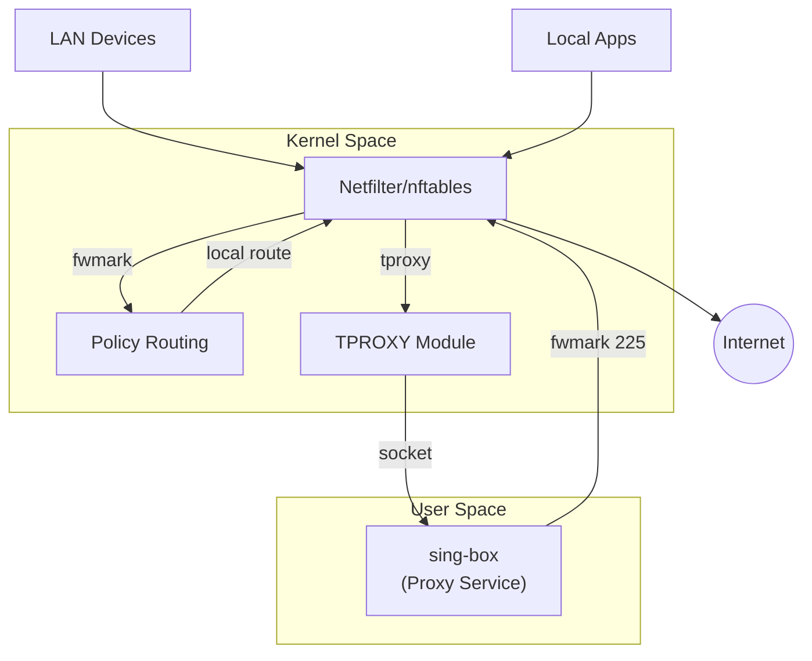

# 架构设计

本文档详细说明 sing-box-tproxy 的技术架构, 透明代理原理以及各组件交互机制.

## 目录

- [架构概览](#architecture-overview)
- [透明代理原理](#transparent-proxy-mechanism)
- [核心配置解析](#configuration-analysis)
- [部署模式](#deployment-modes)

## 架构概览 {#architecture-overview}

sing-box-tproxy 利用 Linux 内核的 TPROXY 特性, 结合 nftables 和策略路由, 实现对本机及局域网流量的透明代理.

### 组件交互



### 核心组件

| 组件           | 职责                                   | 实现方式                                   |
| -------------- | -------------------------------------- | ------------------------------------------ |
| sing-box       | 代理服务, 协议处理                     | systemd service (监听 TPROXY 端口)         |
| nftables       | 流量识别, 打标记 (fwmark), TPROXY 转向 | `inet` table, `prerouting`/`output` chains |
| Policy Routing | 基于 fwmark 的路由决策                 | `ip rule`, `ip route` (table 224)          |

## 透明代理原理 {#transparent-proxy-mechanism}

### 流量路径详解

#### 1. 转发流量 (gateway 模式)

来自局域网设备的流量进入网关:

1.  Prerouting: 流量进入 `prerouting_tproxy` 链.
2.  Filtering: 排除本地保留地址, 自定义绕过地址.
3.  TPROXY: 命中 `tproxy` 规则, 被重定向到 sing-box 监听的 TPROXY 端口 (7895), 并打上 `fwmark 224`.
4.  Routing: 策略路由根据 `fwmark 224` 查表, 但此时流量已被 TPROXY 劫持, 内核直接将数据包分发给 sing-box socket.

#### 2. 本机流量 (local 模式)

本机应用程序发出的流量:

1.  Output: 流量进入 `output_tproxy` 链.
2.  Filtering: 排除 sing-box 自身流量 (防回环), 本地保留地址等.
3.  Marking: 命中规则, 打上 `fwmark 224`.
4.  Reroute: 由于 fwmark 改变, 内核触发重路由 (Reroute Check).
5.  Policy Routing: `ip rule` 匹配 `fwmark 224`, 查询路由表 224.
6.  Local Route: 路由表 224 中包含 `local default dev eth0` 路由. 关键点: `type local` 告诉内核该数据包的目标是"本机".
7.  Loopback: 内核将数据包"环回" (Loopback), 使其重新进入网络协议栈的入站路径.
8.  Prerouting: 环回的数据包再次触发 `prerouting_tproxy` 链.
9.  TPROXY: 命中 `prerouting` 中的 `tproxy` 规则, 最终被重定向到 sing-box.

### 防回环机制 (Loop Prevention)

为了防止 sing-box 发出的代理流量再次被代理形成死循环, 项目采用了双 fwmark 机制:

- `PROXY_MARK` (224): 标记需要被代理的流量 (普通应用).
- `ROUTE_DEFAULT_MARK` (225): 标记 sing-box 自身发出的出站流量.

处理流程:

1.  sing-box 以独立用户 `proxy` (UID 13) 运行.
2.  `output_tproxy` 链首先检查 UID:
    ```nft
    meta skuid 13 meta mark set 225 accept
    ```
3.  sing-box 的流量被打上 225 标记并直接放行 (Accept), 跳过后续的 224 打标规则.
4.  策略路由中没有针对 fwmark 225 的特殊规则, 流量走默认路由表 (main) 直连互联网.

## 核心配置解析 {#configuration-analysis}

### 策略路由 (Policy Routing)

配置位于 `/etc/netplan/99-sing_box_tproxy.yaml`.

```yaml
routing-policy:
  - from: 0.0.0.0/0
    mark: 224
    table: 224
```

路由表 224:

```shell
# ip route show table 224
local default dev eth0 proto static scope host
```

- `type local`: 这是本机透明代理的核心. 它欺骗内核将外发流量视为发往本机的流量, 从而触发 Loopback 和 Prerouting 链, 让 TPROXY 规则有机会处理本机流量.
- `dev eth0`: 指定关联接口, 虽然流量实际上是在内核内部环回, 但指定接口有助于满足命令语法和某些内核检查.

### nftables 规则 (nftables Rules)

#### prerouting_tproxy (入站/环回)

负责处理来自 LAN 的流量和本机环回的流量.

1.  DNS 劫持: `udp/tcp dport 53 tproxy to :7895`. 必须最先执行, 确保 DNS 请求被捕获.
2.  防直接访问: 拒绝直接访问 7895 端口的非 TPROXY 流量.
3.  绕过规则: 放行 `fib daddr type local` (本机目标), 保留地址 (RFC 1918 等) 和用户自定义地址.
4.  TPROXY: `meta mark set 224 tproxy to :7895`. 捕获剩余流量.

#### output_tproxy (本机出站)

负责处理本机发出的流量.

1.  接口过滤: 仅处理默认出口接口的流量.
2.  防回环: `meta skuid 13 accept`. 至关重要.
3.  DNS 标记: 显式标记 DNS 流量 (防止被后续的保留地址规则排除).
4.  绕过规则: 放行本地和保留地址.
5.  打标记: `meta mark set 224`. 仅打标记, 不做 TPROXY (交由策略路由处理).

### IPv6 支持

项目完整支持 IPv6 透明代理.

- 地址集合: 独立定义 `reserved_ip6` (包含 `::1`, `fe80::/10`, `ff00::/8` 以及 `fd00::/8` 等). 注意: `fc00::/18` (sing-box fakeip) 不在排除列表中.
- 策略路由: 添加 IPv6 版本的 rule 和 route (`ip -6 rule`, `ip -6 route`).
- nftables: 使用 `inet` 表同时处理 IPv4/IPv6, 或使用 `meta nfproto ipv6` 区分特定规则.

特殊注意事项:

- Link-Local (fe80::/10): 自动排除, 不进行代理.
- Multicast (ff00::/8): 自动排除.
- IPv4-mapped IPv6 (::ffff:0:0/96): 排除以避免重复处理.

## 部署模式 {#deployment-modes}

| 模式    | 适用场景        | 特点              | 关键差异                                           |
| ------- | --------------- | ----------------- | -------------------------------------------------- |
| gateway | 家庭/办公室网关 | 代理 LAN 所有设备 | 开启 IP Forwarding, 监听 `0.0.0.0`                 |
| local   | 个人工作站/VPS  | 仅代理本机        | 关闭 IP Forwarding, 监听 `127.0.0.1` (TPROXY 除外) |
| mixed   | 开发/测试环境   | 手动配置代理      | 无 nftables/路由规则, 仅作为普通代理服务器         |

_注: 在 gateway 模式下, sing-box TPROXY 入站必须监听 `::` (或 `0.0.0.0`), 因为来自 LAN 的流量目标地址不是本机._
