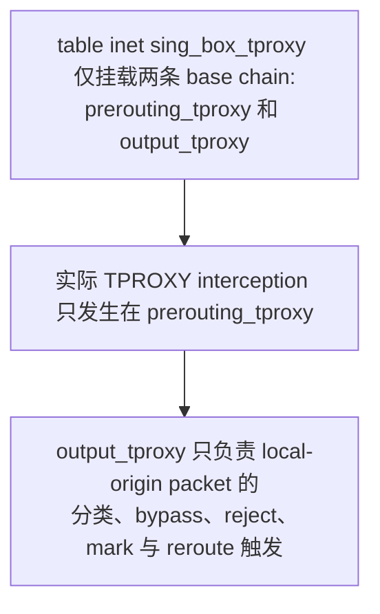
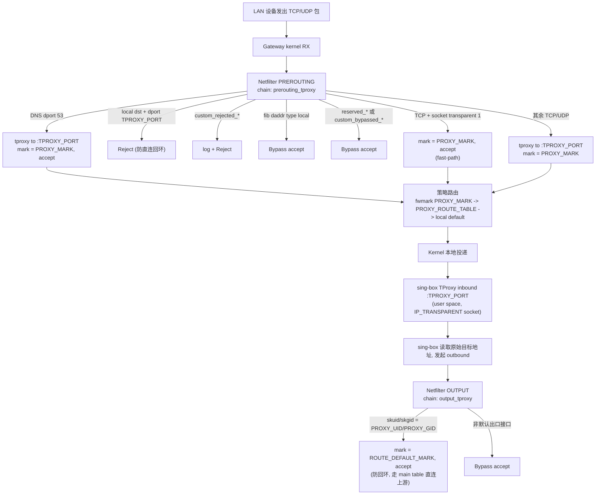
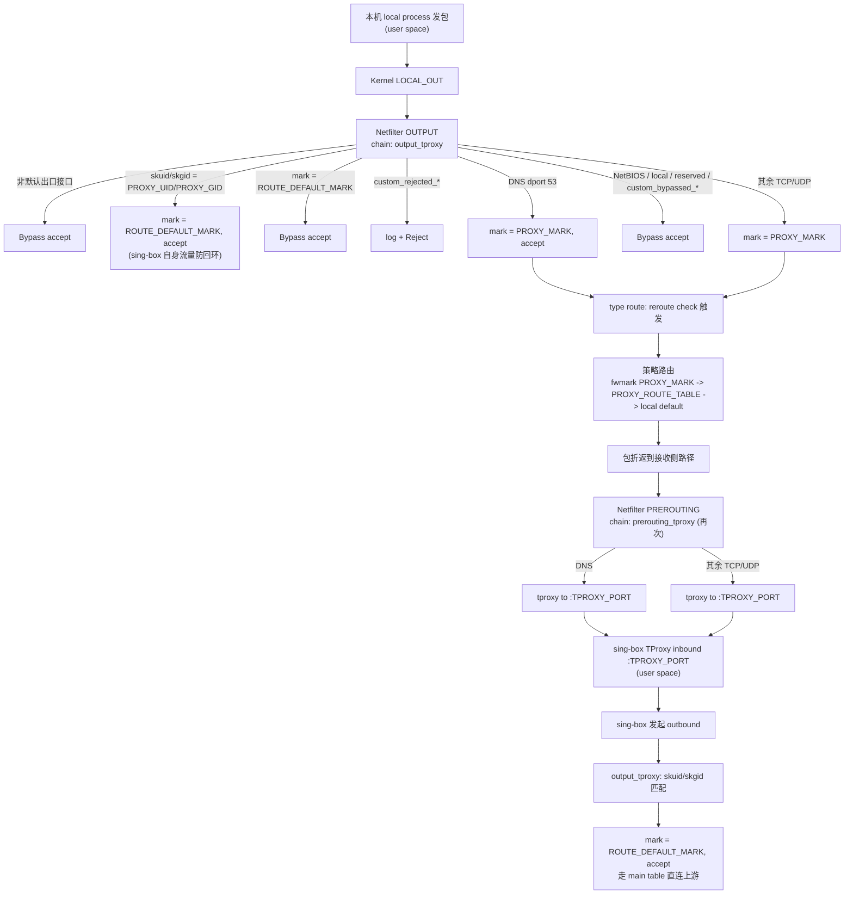

# 架构设计

本文档基于 Jinja2 template 
(`roles/sing_box_tproxy/templates/etc/nftables.d/sing_box_tproxy.nft.j2`)
的语义, 详细说明 sing-box-tproxy 的 nftables TPROXY 透明代理架构、数据包路径与控制流.

## 目录

- [概览](#overview)
- [范围、前提与 template-vs-rendered-instance 区分](#scope)
- [Marks 与策略路由](#marks-and-policy-routing)
- [Netfilter chain 职责](#chain-responsibilities)
- [数据包路径: LAN 设备流量](#packet-path-lan)
- [数据包路径: 网关本机进程流量](#packet-path-local)
- [数据包路径: sing-box 自身流量与防回环](#packet-path-loop-prevention)
- [Template conditionals 与地址族支持](#template-conditionals)
- [特殊情况与例外](#special-cases)
- [Mermaid 架构图](#mermaid-diagram)
- [总结](#summary)

---

## 概览 {#overview}

sing-box-tproxy 利用 Linux 内核的 **TPROXY** (Transparent Proxy) 机制, 结合 **nftables**
与**策略路由** (policy routing), 实现对网关转发流量 (LAN devices) 及网关本机流量
(local processes) 的透明代理.

该架构的核心设计要点:

- `table inet sing_box_tproxy` 仅挂载两条 base chain: `prerouting_tproxy` 与 `output_tproxy`.
- **真正执行 `tproxy to :TPROXY_PORT` 的链只有 `prerouting_tproxy`.**
  table 中所有 TPROXY interception 动作都在此完成.
- **`output_tproxy` 不执行 TPROXY.** 它只负责本机发出数据包的分类、打标 (mark)、
  bypass、reject 与 reroute 触发.
- 网关本机流量先在 `output_tproxy` (OUTPUT hook) 被打上 `PROXY_MARK`, 再借助策略路由
  折返到接收侧路径, 最终由 `prerouting_tproxy` (PREROUTING hook) 完成实际的 TPROXY 截获.
- **sing-box 运行在 user space**; Netfilter 规则处理、策略路由、本地投递均在 **kernel space** 完成.

### 核心组件

| 组件                                    | 空间         | 职责                                                                                        |
| --------------------------------------- | ------------ | ------------------------------------------------------------------------------------------- |
| sing-box                                | user space   | 代理服务, 协议处理; 监听 TPROXY inbound 端口, 以 `IP_TRANSPARENT` socket 接收被截获的数据包 |
| nftables (`table inet sing_box_tproxy`) | kernel space | 流量识别、打标 (fwmark)、bypass、reject、TPROXY interception                                |
| Policy Routing (`ip rule` / `ip route`) | kernel space | 基于 fwmark 的路由决策; 将标记流量导向本地投递路径                                          |

---

## 范围、前提与 template-vs-rendered-instance 区分 {#scope}

### 本文讨论对象

本文讨论的是 **Jinja2 template `sing_box_tproxy.nft.j2` 所表达的架构语义**,
以及其在当前 IPv4-only 渲染实例中的具体落地. 本文不是泛泛而谈 Linux Netfilter 的教材.

### Template 是 canonical source

这份 nftables table 不是手写的最终文件, 而是由 Ansible Jinja2 template 渲染生成的:

- **Template 语义**才是架构文档的 canonical source.
- 当前某个环境渲染出来的 `.nft` 文件只是**一个 deployment-specific instance**.
- 不能因为当前实例只渲染出 IPv4 分支, 就把整个架构写成只支持 IPv4.

### 当前 deployment example

当前被分析的渲染实例是一个 **IPv4-only environment**
(主机没有 IPv6 默认路由, `_sing_box_enable_ipv6` 为 false),
所以最终生成的 table 只包含 IPv4 相关的 set 与 rules. 具体值:

| 变量                 | 值     | 说明                             |
| -------------------- | ------ | -------------------------------- |
| `INTERFACE`          | `eth0` | IPv4 默认出口接口                |
| `TPROXY_PORT`        | `7895` | sing-box TProxy inbound 监听端口 |
| `PROXY_ROUTE_TABLE`  | `224`  | 策略路由表编号                   |
| `PROXY_MARK`         | `224`  | 送入透明代理截获路径的 fwmark    |
| `ROUTE_DEFAULT_MARK` | `225`  | 代理程序自身流量的 bypass mark   |
| `PROXY_UID`          | `13`   | sing-box 运行用户 UID (`proxy`)  |
| `PROXY_GID`          | `13`   | sing-box 运行用户 GID (`proxy`)  |

这些值来自 `roles/sing_box_defaults/vars/main.yaml` 中的默认定义.
实际部署时可通过 Ansible 变量覆盖.

**注意**: 当前 deployment example 没有 `custom_bypassed_ip4/ip6`, 只有 `custom_rejected_ip4`.
这并不代表架构不支持这些 conditional sets — 它们都由 template 按配置条件渲染.

### 策略路由前提

整个架构依赖以下策略路由配置 (由 `sing-box-tproxy-routing.service` 负责添加和移除):

**IPv4 (必须):**

```shell
ip -f inet rule add fwmark $PROXY_MARK lookup $PROXY_ROUTE_TABLE
ip -f inet route add local default dev $INTERFACE table $PROXY_ROUTE_TABLE
```

**IPv6 (当 `_sing_box_enable_ipv6` 为 true 时):**

```shell
ip -f inet6 rule add fwmark $PROXY_MARK lookup $PROXY_ROUTE_TABLE
ip -f inet6 route add local default dev $INTERFACE6 table $PROXY_ROUTE_TABLE
```

以当前部署为例:

```shell
# ip rule show
#   32765: from all fwmark 0xe0 lookup 224
# ip route show table 224
#   local default dev eth0 proto static scope host
```

这条 `local default` 路由的含义: 所有命中此表的数据包, 内核都将其视为
目标是本机的流量, 走**本地投递路径**, 最终交给监听对应端口的 socket.
**没有这套策略路由, `PROXY_MARK` 只是一个无实际效果的标记.**

---

## Marks 与策略路由 {#marks-and-policy-routing}

本架构使用两个语义完全不同的 fwmark, 必须严格区分:

### `PROXY_MARK` (当前值: 224 / 0xe0)

- **含义**: 把数据包送入 sing-box 透明代理截获路径.
- **配套策略路由**: `fwmark PROXY_MARK -> lookup PROXY_ROUTE_TABLE -> local default`.
- **效果**: 被标记的数据包经策略路由后走本地投递路径,
  最终交给 sing-box 的 `IP_TRANSPARENT` socket.
- **使用位置**:
  - `prerouting_tproxy`: DNS TPROXY 规则、transparent socket fast-path 规则、通用 TPROXY 规则.
  - `output_tproxy`: DNS reroute 规则、通用打标规则.

### `ROUTE_DEFAULT_MARK` (当前值: 225 / 0xe1)

- **含义**: 代理程序 (sing-box) 自身产生的流量, **不要再被透明代理一次**.
- **角色**: Loop prevention / bypass mark.
- **配套**: 策略路由中**没有**针对此 mark 的特殊规则, 因此流量走默认路由表 (main table) 直连上游.
- **使用位置**: 仅在 `output_tproxy` 中, 对 `PROXY_UID`/`PROXY_GID` 进程的流量设置此 mark.

> `ROUTE_DEFAULT_MARK` **不是**送进代理的 mark.
> 它与 sing-box 配置中 `route.default_mark` 的目的相同:
> 避免代理自身出站流量被再次截获形成死循环.
> 本架构选择在 nftables 中完成此标记, 而非依赖 sing-box 在 user space 自行添加 fwmark.

---

## Netfilter chain 职责 {#chain-responsibilities}

`table inet sing_box_tproxy` 仅挂载两条 base chain:

### `prerouting_tproxy`

```
type filter hook prerouting priority mangle; policy accept;
```

- 挂载在 Netfilter **PREROUTING** hook, priority mangle.
- **这条链是整个 table 中唯一执行 `tproxy to :TPROXY_PORT` 的地方.**
- 处理两类流量:
  1. 来自 LAN 设备的转发流量 (gateway 模式).
  2. 网关本机流量经策略路由折返后重新进入接收侧路径的数据包.
- 规则处理顺序 (按 template 排列, 从上到下):

| 顺序 | 规则                                | 匹配条件                                                           | 动作                                                |
| ---- | ----------------------------------- | ------------------------------------------------------------------ | --------------------------------------------------- |
| 1    | DNS TPROXY                          | TCP/UDP `dport 53`                                                 | `tproxy to :TPROXY_PORT`, 设置 `PROXY_MARK`, accept |
| 2    | 防 TPROXY 端口直连                  | `fib daddr type local` + TCP/UDP `dport TPROXY_PORT`               | reject (防止回环)                                   |
| 3    | Custom rejected (conditional)       | `ip daddr @custom_rejected_ip4` / `ip6 daddr @custom_rejected_ip6` | log + reject                                        |
| 4    | Bypass local                        | `fib daddr type local`                                             | accept                                              |
| 5    | Bypass reserved IPv4                | `ip daddr @reserved_ip4`                                           | accept                                              |
| 6    | Bypass custom IPv4 (conditional)    | `ip daddr @custom_bypassed_ip4`                                    | accept                                              |
| 7    | Bypass reserved IPv6 (when enabled) | `ip6 daddr @reserved_ip6`                                          | accept                                              |
| 8    | Bypass custom IPv6 (conditional)    | `ip6 daddr @custom_bypassed_ip6`                                   | accept                                              |
| 9    | Transparent socket fast-path        | TCP + `socket transparent 1`                                       | 设置 `PROXY_MARK`, accept                           |
| 10   | 通用 TPROXY                         | 剩余 TCP/UDP                                                       | `tproxy to :TPROXY_PORT`, 设置 `PROXY_MARK`         |

### `output_tproxy`

```
type route hook output priority mangle; policy accept;
```

- 挂载在 Netfilter **OUTPUT** hook, priority mangle.
- 使用 `type route` — 当此链中的规则修改了影响路由决策的字段 (如 fwmark),
  内核会自动触发 **reroute check**, 使数据包按新 mark 重新做路由决策.
- **这条链不执行任何 `tproxy to` 动作.**
  它只负责本机发出数据包的分类、打标、bypass、reject 与 reroute 触发.
- 规则处理顺序:

| 顺序 | 规则                                        | 匹配条件                                                           | 动作                              |
| ---- | ------------------------------------------- | ------------------------------------------------------------------ | --------------------------------- |
| 1    | IPv4 egress-interface filter                | `oifname != INTERFACE`                                             | accept (不处理非默认出口)         |
| 2    | IPv6 egress-interface filter (when enabled) | `meta nfproto ipv6 oifname != INTERFACE6`                          | accept                            |
| 3    | Proxy-self bypass                           | `skuid PROXY_UID skgid PROXY_GID`                                  | 设置 `ROUTE_DEFAULT_MARK`, accept |
| 4    | Already-marked bypass                       | `meta mark ROUTE_DEFAULT_MARK`                                     | accept                            |
| 5    | Custom rejected (conditional)               | `ip daddr @custom_rejected_ip4` / `ip6 daddr @custom_rejected_ip6` | log + reject                      |
| 6    | DNS reroute                                 | TCP/UDP `dport 53`                                                 | 设置 `PROXY_MARK`, accept         |
| 7    | Bypass NetBIOS                              | UDP `dport { netbios-ns, netbios-dgm, netbios-ssn, microsoft-ds }` | accept                            |
| 8    | Bypass local                                | `fib daddr type local`                                             | accept                            |
| 9    | Bypass reserved IPv4                        | `ip daddr @reserved_ip4`                                           | accept                            |
| 10   | Bypass custom IPv4 (conditional)            | `ip daddr @custom_bypassed_ip4`                                    | accept                            |
| 11   | Bypass reserved IPv6 (when enabled)         | `ip6 daddr @reserved_ip6`                                          | accept                            |
| 12   | Bypass custom IPv6 (conditional)            | `ip6 daddr @custom_bypassed_ip6`                                   | accept                            |
| 13   | Generic marking                             | 剩余 TCP/UDP                                                       | 设置 `PROXY_MARK`                 |

---

## 数据包路径: LAN 设备流量 {#packet-path-lan}

当 gateway 作为 LAN 的默认网关时, LAN 设备发起的 TCP/UDP 流量经过以下路径:

### 1. 数据包到达 gateway kernel (kernel space)

LAN 设备发出的数据包到达 gateway 网卡, 进入 kernel space 的网络协议栈.
**此流量不经过 `output_tproxy`** — OUTPUT hook 只处理本机 local process 发出的包.

### 2. PREROUTING hook — `prerouting_tproxy` (kernel space)

数据包命中 `prerouting_tproxy` 链. 按规则顺序:

- **DNS 流量** (`dport 53`): 最先被匹配, 执行 `tproxy to :TPROXY_PORT`,
  设置 `PROXY_MARK`, accept. DNS 是优先级最高的一类流量 —
  它在所有 bypass / reserved 规则之前就被截获, 确保所有 DNS 请求都经过 sing-box 处理.
- **直连 TPROXY 端口** (`fib daddr type local` + `dport TPROXY_PORT`): reject.
  防止某 LAN 设备或本机进程直接访问 TPROXY 端口形成回环.
- **Custom rejected** (conditional): 如配置了 `custom_rejected_ip4/ip6`,
  对应目标地址的包被 log 并 reject.
- **Bypass local** (`fib daddr type local`): 目标为 gateway 本机地址的包直接 accept,
  不做透明代理.
- **Bypass reserved** (`reserved_ip4` / `reserved_ip6`): RFC 1918 私有地址、
  回环、链路本地、组播等保留地址直接 accept.
- **Bypass custom** (conditional): 如配置了 `custom_bypassed_ip4/ip6`,
  对应目标地址的包直接 accept.
- **Transparent socket fast-path** (`socket transparent 1`):
  对已匹配到 transparent socket 的 TCP 包设置 `PROXY_MARK` 并 accept,
  使这些包继续沿 transparent socket 的本地投递路径走 (见特殊情况节).
- **通用 TPROXY**: 剩余所有 TCP/UDP 执行 `tproxy to :TPROXY_PORT`,
  设置 `PROXY_MARK`.

### 3. 策略路由 (kernel space)

PREROUTING 结束后, 内核做路由决策. 被标记了 `PROXY_MARK` 的包命中策略路由规则:

```
fwmark PROXY_MARK -> lookup PROXY_ROUTE_TABLE -> local default dev INTERFACE
```

内核将这些包视为目标是本机的流量, 走**本地投递路径**.

**被截获的 LAN 包不会沿普通 FORWARD 路径走到外网再进入 sing-box.**
策略路由在 PREROUTING 之后的路由决策阶段直接将包导向本地投递.

### 4. 本地投递给 sing-box (kernel space -> user space)

内核将数据包投递给监听 `TPROXY_PORT` 的 `IP_TRANSPARENT` socket,
即 sing-box 的 TProxy inbound. 此时进入 **user space**.

sing-box 接收该包, 读取原始目标地址 (而非 gateway 自身地址),
得知 LAN 设备真正要访问的目标, 进行透明代理处理.

### 5. sing-box 发起 outbound 连接 (user space -> kernel space)

sing-box 以 `proxy` 用户 (UID/GID = `PROXY_UID`/`PROXY_GID`) 身份
向上游发起出站连接. 该包进入 kernel space, 经过 `output_tproxy`
被打上 `ROUTE_DEFAULT_MARK` 并 accept, 走默认路由表直连上游.

---

## 数据包路径: 网关本机进程流量 {#packet-path-local}

网关本机 local process (如系统更新、curl 等, **非 sing-box 自身**) 发出的
TCP/UDP 流量经过以下路径:

### 1. LOCAL_OUT (kernel space)

本机进程在 user space 发包, 内核生成数据包进入 LOCAL_OUT 路径.

### 2. OUTPUT hook — `output_tproxy` (kernel space)

数据包命中 `output_tproxy` 链. 按规则顺序:

- **Egress-interface filter**: 如果出口接口不是 `INTERFACE` (IPv4) 或
  `INTERFACE6` (IPv6, when enabled), 直接 accept, 不做任何处理.
- **Proxy-self bypass**: 如果是 `proxy` 用户 (UID=`PROXY_UID`, GID=`PROXY_GID`) 发出的包,
  设置 `ROUTE_DEFAULT_MARK` 并 accept. 这是 sing-box 自身流量的防回环处理.
- **Already-marked bypass**: 已有 `ROUTE_DEFAULT_MARK` 的包直接 accept.
- **Custom rejected** (conditional): 配置了 `custom_rejected_ip4/ip6` 时 reject.
- **DNS reroute** (`dport 53`): 设置 `PROXY_MARK`, accept.
  DNS 流量被优先标记, 确保本机 DNS 也经过 sing-box 处理.
- **Bypass NetBIOS**: Windows 网络相关 UDP 端口直接 accept.
- **Bypass local / reserved / custom**: 目标为本机、保留地址、自定义绕过地址时 accept.
- **Generic marking**: 剩余 TCP/UDP 设置 `PROXY_MARK`.

**重要: `output_tproxy` 只做 mark, 不做 TPROXY.**

### 3. Reroute check (kernel space)

因为 `output_tproxy` 是 `type route hook output`, 规则修改了 fwmark 后,
内核自动触发 **reroute check**. 命中 `PROXY_MARK` 的包重新做路由决策:

```
fwmark PROXY_MARK -> lookup PROXY_ROUTE_TABLE -> local default dev INTERFACE
```

内核将该出站包的目标判定为本机, 切换到**接收侧路径**,
使数据包**重新进入 PREROUTING hook**.

### 4. PREROUTING hook — `prerouting_tproxy` (再次, kernel space)

折返后的数据包再次进入 `prerouting_tproxy`. 由于原始目标地址被保留,
规则正常匹配:

- DNS 流量命中 DNS TPROXY 规则.
- 其他 TCP/UDP 命中通用 TPROXY 规则.

执行 `tproxy to :TPROXY_PORT`, 设置 `PROXY_MARK`. **这才是真正发生 TPROXY 截获的地方.**

### 5. 策略路由与本地投递 (kernel space -> user space)

与 LAN 流量相同: 策略路由将包导向本地投递, 交给 sing-box 的 `IP_TRANSPARENT` socket.

### 关键结论

> **本机流量的 `output_tproxy` 只负责分类和打标; 真正把包交给 sing-box 的动作,
> 仍然发生在 `prerouting_tproxy`.**
> 如果没有 `ip rule` / `ip route` 策略路由配置,
> `output_tproxy` 只是在 OUTPUT 打了一个 mark, 包根本不会送进 sing-box.

---

## 数据包路径: sing-box 自身流量与防回环 {#packet-path-loop-prevention}

sing-box 以 `proxy` 用户 (UID=`PROXY_UID`, GID=`PROXY_GID`) 运行.
它作为 TProxy inbound 接收被截获的数据包后, 会在 user space 发起 outbound 连接.
这些 outbound 包**不能再次被透明代理**, 否则会形成死循环.

### 防回环机制

`output_tproxy` 中的这条规则:

```nft
meta skuid $PROXY_UID meta skgid $PROXY_GID     meta mark set $ROUTE_DEFAULT_MARK accept comment "Mark PROXY user process packets"
```

作用:

1. 匹配 `proxy` 用户发出的所有包 (即 sing-box 的 outbound 流量).
2. 设置 `ROUTE_DEFAULT_MARK` (当前值: 225).
3. 直接 **accept** — 跳出 `output_tproxy` 链, 不再执行后续规则.

由于策略路由中没有针对 `ROUTE_DEFAULT_MARK` 的规则,
sing-box 的 outbound 包走默认路由表 (main table), 按正常路由直连上游.

### 双重保障

即使某个包因为某种原因已经带有 `ROUTE_DEFAULT_MARK` 再次进入 `output_tproxy`,
链中的第四条规则也会将其直接 accept:

```nft
meta mark $ROUTE_DEFAULT_MARK accept comment "Bypass marked packets"
```

### 与 sing-box `route.default_mark` 的关系

sing-box 配置中有 `route.default_mark` 选项, 作用相同: 让 sing-box 在 user space
给自己发出的包打上特定 fwmark, 避免被再次截获. 本架构选择在 **nftables 中统一处理**,
而不依赖 sing-box 自行添加 fwmark. 两者不可同时使用 (会导致 mark 冲突).

---

## Template conditionals 与地址族支持 {#template-conditionals}

### Template 级别: Dual-stack capable

**这个 table 的控制流架构在 IPv4 和 IPv6 上是一致的:**

- 真正的 interception point 仍然只有 `prerouting_tproxy`.
- `output_tproxy` 仍然只负责 local-origin packet 的分类、打标、bypass、reject 与 reroute.
- `PROXY_MARK` / `ROUTE_DEFAULT_MARK` 的语义不变.

当 `_sing_box_enable_ipv6` 为 true 时 (即主机存在 IPv6 默认路由),
template 还会额外渲染以下内容:

| 额外内容                                            | 说明                                                      |
| --------------------------------------------------- | --------------------------------------------------------- |
| `define INTERFACE6`                                 | IPv6 默认出口接口变量                                     |
| `set reserved_ip6`                                  | IPv6 保留地址集合 (::1, fe80::/10, ff00::/8, fd00::/8 等) |
| `set custom_bypassed_ip6` (conditional)             | 用户自定义 IPv6 绕过地址                                  |
| `set custom_rejected_ip6` (conditional)             | 用户自定义 IPv6 拒绝地址                                  |
| `prerouting_tproxy` 中的 IPv6 reject/bypass 分支    | 与 IPv4 分支对称                                          |
| `output_tproxy` 中的 IPv6 egress-interface 过滤规则 | `meta nfproto ipv6 oifname != INTERFACE6`                 |
| `output_tproxy` 中的 IPv6 bypass 分支               | 与 IPv4 分支对称                                          |
| `ip -f inet6 rule` / `ip -f inet6 route` (策略路由) | IPv6 的 fwmark -> 本地投递                                |

**IPv6 enabled 时, packet path 的控制流不变; 变化的是 IPv6 对应的地址族匹配条件、
conditional sets 与 policy-routing prerequisites.**

### 当前 deployment example: IPv4-only

当前渲染实例 (`_sing_box_enable_ipv6` = false) 中不存在以下内容:

- `INTERFACE6`
- `reserved_ip6`
- `custom_bypassed_ip6` / `custom_rejected_ip6`
- `output_tproxy` 中的 IPv6 egress-interface 规则
- IPv6 bypass/reject 分支
- `ip -f inet6 rule` / `ip -f inet6 route`

**这不代表架构不支持 IPv6.** 这只是一个 IPv4-only 的部署实例.

### Conditional sets 汇总

以下 set 均为 template-conditional, **不是每次部署都必然存在**:

| Set                   | 渲染条件                                           | 说明                     |
| --------------------- | -------------------------------------------------- | ------------------------ |
| `custom_bypassed_ip4` | `sing_box_custom_bypassed_ip4` 非空                | 用户自定义 IPv4 绕过地址 |
| `custom_bypassed_ip6` | IPv6 enabled + `sing_box_custom_bypassed_ip6` 非空 | 用户自定义 IPv6 绕过地址 |
| `custom_rejected_ip4` | `sing_box_custom_rejected_ip4` 非空                | 用户自定义 IPv4 拒绝地址 |
| `custom_rejected_ip6` | IPv6 enabled + `sing_box_custom_rejected_ip6` 非空 | 用户自定义 IPv6 拒绝地址 |

当前 deployment example 只有 `custom_rejected_ip4`, 没有其他 conditional sets.

---

## 特殊情况与例外 {#special-cases}

### Transparent socket fast-path

`prerouting_tproxy` 中有一条规则:

```nft
meta l4proto tcp socket transparent 1 meta mark set $PROXY_MARK accept comment "Bypass established transparent proxy connections"
```

这是对**已经匹配到 transparent socket 的 TCP 包**的 shortcut / fast-path.

它的作用是: 对已关联到 transparent socket 的 TCP 包直接设置 `PROXY_MARK` 并 accept,
使这些包继续沿 transparent socket 的本地投递路径走, 而不需要再次执行完整的 TPROXY 动作.

### NetBIOS bypass

`output_tproxy` 专门对 NetBIOS 相关 UDP 端口 (netbios-ns, netbios-dgm,
netbios-ssn, microsoft-ds) 做了 bypass. 这些端口的广播流量不应进入代理.

### `reserved_ip4` 不包含 `198.18.0.0/15`

template 中 `198.18.0.0/15` (Benchmarking / sing-box fakeip 范围)
被注释掉, 不在 bypass 列表中. 这意味着 sing-box fakeip 地址的流量会被正常截获并处理.
这是有意为之的设计.

### `reserved_ip6` 不包含 `fc00::/18`

IPv6 段的 `fc00::/18` (sing-box fakeip 范围) 未加入 bypass 列表,
理由与 IPv4 的 `198.18.0.0/15` 相同.
`fd00::/8` 在 bypass 列表中, 但 template 注释说明排除了其中的 `fc00::/18` 子集.

### Egress-interface filtering 的优先级

`output_tproxy` 前两条规则是 egress-interface filtering:

```nft
oifname != $INTERFACE accept
# (when IPv6 enabled)
meta nfproto ipv6 oifname != $INTERFACE6 accept
```

只有从默认出口接口 (INTERFACE / INTERFACE6) 出去的流量才会被后续规则处理.
走其他接口 (如 loopback `lo`、LAN 接口等) 的流量直接 accept, 不做任何 mark,
避免对内部流量误打标记.

---

## Mermaid 架构图 {#mermaid-diagram}

### 架构固定事实


```mermaid
flowchart TD
  C1["table inet sing_box_tproxy 仅挂载两条 base chain:<br/>prerouting_tproxy 和 output_tproxy"]
  C1 --> C2["实际 TPROXY interception 只发生在 prerouting_tproxy"]
  C2 --> C3["output_tproxy 只负责 local-origin packet 的<br/>分类、bypass、reject、mark 与 reroute 触发"]
```

### 场景 A: LAN 设备流量


```mermaid
flowchart TD
  A1["LAN 设备发出 TCP/UDP 包"] --> A2["Gateway kernel RX"]
  A2 --> A3["Netfilter PREROUTING<br/>chain: prerouting_tproxy"]

  A3 -->|"DNS dport 53"| A4["tproxy to :TPROXY_PORT<br/>mark = PROXY_MARK, accept"]
  A3 -->|"local dst + dport TPROXY_PORT"| A5["Reject (防直连回环)"]
  A3 -->|"custom_rejected_*"| A6["log + Reject"]
  A3 -->|"fib daddr type local"| A7["Bypass accept"]
  A3 -->|"reserved_* 或 custom_bypassed_*"| A8["Bypass accept"]
  A3 -->|"TCP + socket transparent 1"| A9["mark = PROXY_MARK, accept<br/>(fast-path)"]
  A3 -->|"其余 TCP/UDP"| A10["tproxy to :TPROXY_PORT<br/>mark = PROXY_MARK"]

  A4 --> A11["策略路由<br/>fwmark PROXY_MARK -> PROXY_ROUTE_TABLE -> local default"]
  A9 --> A11
  A10 --> A11

  A11 --> A12["Kernel 本地投递"]
  A12 --> A13["sing-box TProxy inbound :TPROXY_PORT<br/>(user space, IP_TRANSPARENT socket)"]
  A13 --> A14["sing-box 读取原始目标地址, 发起 outbound"]
  A14 --> A15["Netfilter OUTPUT<br/>chain: output_tproxy"]
  A15 -->|"skuid/skgid = PROXY_UID/PROXY_GID"| A16["mark = ROUTE_DEFAULT_MARK, accept<br/>(防回环, 走 main table 直连上游)"]
  A15 -->|"非默认出口接口"| A17["Bypass accept"]
```

### 场景 B: 网关本机进程流量


```mermaid
flowchart TD
  B1["本机 local process 发包<br/>(user space)"] --> B2["Kernel LOCAL_OUT"]
  B2 --> B3["Netfilter OUTPUT<br/>chain: output_tproxy"]

  B3 -->|"非默认出口接口"| B4["Bypass accept"]
  B3 -->|"skuid/skgid = PROXY_UID/PROXY_GID"| B5["mark = ROUTE_DEFAULT_MARK, accept<br/>(sing-box 自身流量防回环)"]
  B3 -->|"mark = ROUTE_DEFAULT_MARK"| B6["Bypass accept"]
  B3 -->|"custom_rejected_*"| B7["log + Reject"]
  B3 -->|"DNS dport 53"| B8["mark = PROXY_MARK, accept"]
  B3 -->|"NetBIOS / local / reserved / custom_bypassed_*"| B9["Bypass accept"]
  B3 -->|"其余 TCP/UDP"| B10["mark = PROXY_MARK"]

  B8 --> B11["type route: reroute check 触发"]
  B10 --> B11
  B11 --> B12["策略路由<br/>fwmark PROXY_MARK -> PROXY_ROUTE_TABLE -> local default"]
  B12 --> B13["包折返到接收侧路径"]
  B13 --> B14["Netfilter PREROUTING<br/>chain: prerouting_tproxy (再次)"]
  B14 -->|"DNS"| B15["tproxy to :TPROXY_PORT"]
  B14 -->|"其余 TCP/UDP"| B16["tproxy to :TPROXY_PORT"]
  B15 --> B17["sing-box TProxy inbound :TPROXY_PORT<br/>(user space)"]
  B16 --> B17
  B17 --> B18["sing-box 发起 outbound"]
  B18 --> B19["output_tproxy: skuid/skgid 匹配"]
  B19 --> B20["mark = ROUTE_DEFAULT_MARK, accept<br/>走 main table 直连上游"]
```

> **关键说明:**
> - 只有 `prerouting_tproxy` 执行 `tproxy to :TPROXY_PORT`
> - `PROXY_MARK`: 送入透明代理截获路径; `ROUTE_DEFAULT_MARK`: 代理自身流量不再被透明代理
> - `_sing_box_enable_ipv6=true` 时控制流不变, 变化的是 IPv6 匹配条件、conditional sets (`reserved_ip6` 等) 与 `inet6` 策略路由前提; 当前 deployment example 为 IPv4-only

---

## 总结 {#summary}

| 关键点                 | 说明                                                                                            |
| ---------------------- | ----------------------------------------------------------------------------------------------- |
| TPROXY 执行位置        | **只有 `prerouting_tproxy`** 执行 `tproxy to :TPROXY_PORT`                                      |
| `output_tproxy` 的职责 | 分类、打标、bypass、reject、reroute 触发; **不执行 TPROXY**                                     |
| LAN 流量路径           | PREROUTING TPROXY → 策略路由 → kernel 本地投递 → sing-box user space                            |
| 本机流量路径           | OUTPUT 打 mark → reroute → PREROUTING TPROXY → 策略路由 → kernel 本地投递 → sing-box user space |
| `PROXY_MARK`           | 送入透明代理截获路径 (配套策略路由: `fwmark -> local default`)                                  |
| `ROUTE_DEFAULT_MARK`   | sing-box 自身流量的 loop prevention mark; **不是送进代理的 mark**                               |
| 防回环                 | `output_tproxy` 对 `PROXY_UID`/`PROXY_GID` 进程设置 `ROUTE_DEFAULT_MARK` 并 accept              |
| 策略路由是必要条件     | 没有 `ip rule` + `ip route local default`, `PROXY_MARK` 无实际效果                              |
| 双栈支持               | Template 级别 dual-stack capable; **当前 deployment example 为 IPv4-only**                      |
| Conditional sets       | `custom_bypassed_*` / `custom_rejected_*` 均为 template-conditional, 非每次部署都存在           |
